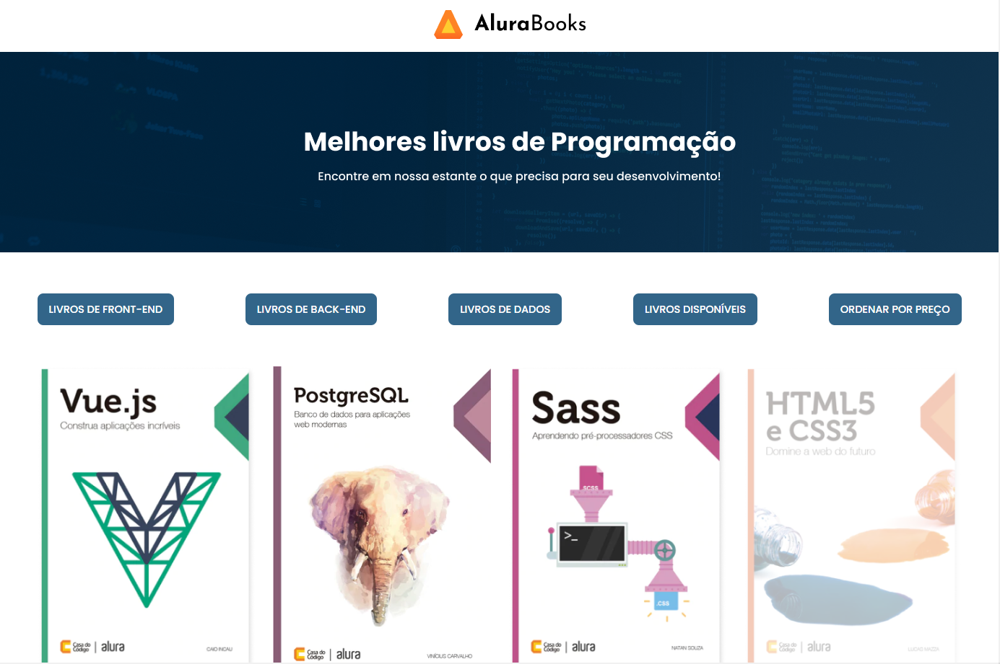

# AluraBook | JavaScript: métodos de array

Repositório com projeto AluraBook desenvolvido durante o curso JavaScript: métodos de array da [Alura](https://www.alura.com.br/) Escola Online de Tecnologia.

## 📁 Detalhes do projeto

	

 

O AluraBook é um e-commerce de livros de programação fictício.

O foco desse projeto foi desenvolver toda parte dinâmica da página de produtos, como adicionar lista de livros, aplicar descontos nos produtos, fazer filtragem de livros por categoria, ordem de preços e disponibilidade. Além de manipular elementos via JS.

A lista de produtos foi adicionada através de endpoint disponibilizado pelo instrutor do curso.

## 📚 Temas abordados

* Método `forEach()`;
* Adicionar lista de livros de forma dinâmica;
* Método `map()`;
* Aplicar um desconto em cada um dos valores dos livros;
* Método `filter()`;
* Filtragem de livros por categoria;
* Método `sort()`;
* Ordenar livros por preço;
* Implementar lógica de livros disponíveis;
* Exibir sessão via JavaScript;
* Método `reduce()`;
* Somar valores de produtos de forma dinâmica. 

## 🖥️ Acesso ao projeto

[Clique aqui](https://alurabook-kappa-teal.vercel.app/) para acessar a página de livros do AluraBook.

Para testar as funcionalidades desenvolvidas basta clicar nos botões em destaque logo acima da lista de livros.

	

 

Nessa fase o projeto está disponível apenas para desktops com resolução a partir de 1400px. Caso acesse em uma tela menor, algumas quebras podem ocorrer.

## 👩‍💻 Tecnologias utilizadas

	
	
	

Desenvolvido com 💙 por [Juliana Lucca](https://www.linkedin.com/in/julianalucca/).

Projeto original desenvolvido por [Alura](https://www.alura.com.br/).